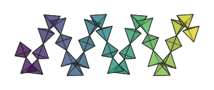
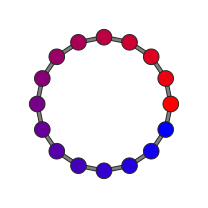
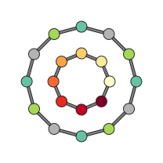

Colouring by per-atom data
==========================

Atoms can be coloured by arbitrary metadata instead of by species.
Use :meth:`~hofmann.StructureScene.set_atom_data` to attach a named
array and the ``colour_by`` parameter on
:meth:`~hofmann.StructureScene.render_mpl` to activate it.

Continuous data
---------------

Numerical arrays are mapped through a colourmap.  By default the
data range is auto-scaled; use ``colour_range`` to fix the limits.

.. code-block:: python

   import numpy as np

   angles = np.linspace(0, 360, len(scene.species), endpoint=False)
   scene.set_atom_data("angle", angles)
   scene.render_mpl("output.svg", colour_by="angle", cmap="twilight")

.. image:: _static/colour_by_continuous.svg
   :width: 320px
   :align: center
   :alt: Ring of atoms coloured by angle

Categorical data
----------------

String arrays assign a distinct colour to each unique value.

.. code-block:: python

   labels = ["alpha", "beta", "gamma", "delta"] * 4
   scene.set_atom_data("site", labels)
   scene.render_mpl("output.svg", colour_by="site", cmap="Set2")

.. image:: _static/colour_by_categorical.svg
   :width: 320px
   :align: center
   :alt: Ring of atoms coloured by categorical site labels

Atoms with ``NaN`` (numeric) or ``""`` (categorical) values fall
back to their species colour.  This is useful when metadata is only
available for a subset of atoms:

.. code-block:: python

   # Only colour specific atoms by charge; the rest keep species colours.
   scene.set_atom_data("charge", {0: 1.2, 3: -0.8, 5: 0.4})

Custom colouring functions
--------------------------

Instead of a colourmap name you can pass any callable that maps a
float in ``[0, 1]`` to an ``(r, g, b)`` tuple:

.. code-block:: python

   def red_blue(t: float) -> tuple[float, float, float]:
       """Linearly interpolate from red to blue."""
       return (1.0 - t, 0.0, t)

   scene.render_mpl("output.svg", colour_by="charge", cmap=red_blue)

This works with any callable, including ``lambda`` expressions and
matplotlib ``Colormap`` objects.

Multiple colouring layers
-------------------------

When different subsets of atoms should use different colouring rules,
pass a list of keys to ``colour_by``.  Each layer is tried in order
and the first non-missing value wins.  ``cmap`` and ``colour_range``
can also be lists of the same length (or a single value broadcast to
all layers).

Layers can freely mix categorical and continuous data.  In this
example the outer ring is coloured by a categorical metal type while
the inner ring uses a numerical charge gradient:

.. code-block:: python

   # Outer atoms: categorical type.
   scene.set_atom_data("metal", {0: "Fe", 1: "Co", 2: "Ni"})
   # Inner atoms: numerical charge.
   scene.set_atom_data("charge", {12: 0.0, 13: 0.3})
   scene.render_mpl(
       "output.svg",
       colour_by=["metal", "charge"],
       cmap=["Set2", "YlOrRd"],
   )

Atoms with missing data in all layers fall back to their species
colour.

Polyhedra colour inheritance
----------------------------

When a :class:`~hofmann.PolyhedronSpec` has no explicit ``colour``,
polyhedra inherit the resolved colour of their centre atom.  This
means ``colour_by`` colouring automatically flows through to
polyhedra without any additional configuration.

.. code-block:: python

   from hofmann import PolyhedronSpec

   # No colour on the spec -- polyhedra inherit from colour_by.
   spec = PolyhedronSpec(centre="M", alpha=0.4)

   scene.set_atom_data("val", {0: 0.0, 1: 0.5, 2: 1.0})
   scene.render_mpl(
       "output.svg",
       colour_by="val", cmap="coolwarm",
   )

.. list-table::
   :widths: 50 50

   * - .. figure:: _static/colour_by_polyhedra_atoms.svg

          With centre and vertex atoms visible

     - .. figure:: _static/colour_by_polyhedra.svg

          Atoms hidden (typical usage)

If a ``PolyhedronSpec`` provides an explicit ``colour``, that
colour always takes precedence over ``colour_by``.
