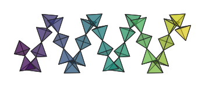
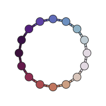
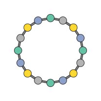
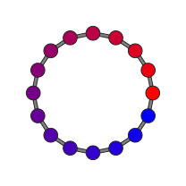
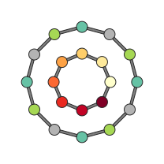

Colouring by per-atom data
==========================

Instead of colouring atoms according to their species, atoms can be
assigned per-atom data that is then used to assign specific colours.

Continuous data
---------------

A common use case is to colour atoms according to individual
numerical data.  Here, each atom is assigned an ``angle`` value
corresponding to the azimuthal angle of that atom in the ring.  At
render time, each atom's ``angle`` value is mapped to a colour
using the ``twilight`` colourmap:

.. code-block:: python

   import numpy as np

   angles = np.linspace(0, 360, len(scene.species), endpoint=False)
   scene.set_atom_data("angle", angles)
   scene.render_mpl("output.svg", colour_by="angle", cmap="twilight")

The data range is auto-scaled by default.  To fix the limits (for
example, to share a colour scale across multiple figures), pass
``colour_range``:

.. code-block:: python

   scene.render_mpl("output.svg", colour_by="angle", colour_range=(0, 360))

Categorical data
----------------

Atoms can also be assigned categorical data — site labels,
coordination environments, oxidation states.  Each unique value
gets its own colour:

.. code-block:: python

   labels = ["alpha", "beta", "gamma", "delta"] * 4
   scene.set_atom_data("site", labels)
   scene.render_mpl("output.svg", colour_by="site", cmap="Set2")

Custom colouring functions
--------------------------

You are not limited to named colourmaps.  Any callable that maps a
float in ``[0, 1]`` to an ``(r, g, b)`` tuple works — including
``lambda`` expressions and matplotlib ``Colormap`` objects:

.. code-block:: python

   def red_blue(t: float) -> tuple[float, float, float]:
       """Linearly interpolate from red to blue."""
       return (1.0 - t, 0.0, t)

   scene.render_mpl("output.svg", colour_by="charge", cmap=red_blue)

Colouring a subset of atoms
----------------------------

In the examples above, ``set_atom_data`` is called with one value
for every atom in the scene.  To leave some atoms uncoloured, set
their values to ``NaN`` (for numeric data) or ``None`` (for
categorical data).  These atoms will fall back to their default
species colour:

.. code-block:: python

   charges = np.array([1.2, np.nan, -0.8])  # atom 1 keeps its species colour
   scene.set_atom_data("charge", charges)

For cases when you only have data for some atoms,
``set_atom_data`` provides convenience arguments that allow you
to set data for a subset of atoms, without having to explicitly
specify "no data" for the other atoms in the scene.
``by_species`` and ``by_index`` let you provide just the values
you want to set.  The rest are filled with ``NaN`` or ``None``,
as appropriate, automatically:

.. code-block:: python

   # Set a charge for each Mn atom (one value per Mn in the scene).
   scene.set_atom_data("charge", by_species={"Mn": [2.0, 1.8, 2.1]})

   # A single value is broadcast to all atoms of that species.
   scene.set_atom_data("charge", by_species={"Mn": 2.0})

   # Assign by atom index instead of by species.
   scene.set_atom_data("charge", by_index={0: 1.2, 3: -0.8})

If ``by_species`` and ``by_index`` are both specified,
``by_species`` values are applied first, then ``by_index`` values
are applied over the top.  This is useful for setting a default
and then overriding a few atoms:

.. code-block:: python

   # All Mn atoms charge 2.0, except atom 3 (defect site) at 1.9.
   scene.set_atom_data(
       "charge",
       by_species={"Mn": 2.0},
       by_index={3: 1.9},
   )

Another pattern is where you have a full-length array but only
want to set data for a certain species.
:meth:`~hofmann.StructureScene.select_by_species` can be used to
produce a copy with non-selected atoms replaced by ``NaN`` or
``None``, as appropriate:

.. code-block:: python

   filtered = scene.select_by_species(full_charge_array, "O")
   # filtered has the same shape as full_charge_array, but only
   # O atoms keep their values — everything else is NaN.

   scene.set_atom_data("charge", filtered)

Multiple colouring layers
-------------------------

Different subsets of atoms can use different colouring rules in the
same render.  Pass a list of keys to ``colour_by``; each layer is
tried in order and the first non-missing value wins.

Layers can freely mix categorical and continuous data.  In this
example the scene has two species — "A" (outer ring) and "B" (inner
ring).  The outer ring is coloured by a categorical metal type, and
the inner ring by a numerical charge gradient:

.. code-block:: python

   # Outer ring: repeating categorical labels.
   scene.set_atom_data(
       "metal",
       by_species={"A": ["Fe", "Co", "Ni"] * 4},
   )
   # Inner ring: numerical gradient.
   scene.set_atom_data("charge", by_species={"B": np.linspace(0, 1, 8)})
   scene.render_mpl(
       "output.svg",
       colour_by=["metal", "charge"],
       cmap=["Set2", "YlOrRd"],
   )

Atoms with missing data in all layers fall back to their species
colour.

Polyhedra colour inheritance
----------------------------

When a :class:`~hofmann.PolyhedronSpec` has no explicit ``colour``,
polyhedra inherit the resolved colour of their centre atom.  This
means ``colour_by`` colouring automatically flows through to
polyhedra without any additional configuration:

.. code-block:: python

   from hofmann import PolyhedronSpec

   # No colour on the spec -- polyhedra inherit from colour_by.
   spec = PolyhedronSpec(centre="M", alpha=0.4)

   scene.set_atom_data("val", by_index={0: 0.0, 1: 0.5, 2: 1.0})
   scene.render_mpl(
       "output.svg",
       colour_by="val", cmap="coolwarm",
   )

.. list-table::
   :widths: 50 50

   * - .. figure:: _static/colour_by_polyhedra_atoms.svg

          With centre and vertex atoms visible

     - .. figure:: _static/colour_by_polyhedra.svg

          Atoms hidden (typical usage)

If a ``PolyhedronSpec`` provides an explicit ``colour``, that
colour always takes precedence over ``colour_by``.

Per-frame colouring
-------------------

Per-atom data can also vary across frames in a trajectory, so that
colours update as the animation progresses.  See the
:doc:`animations` guide for details.
