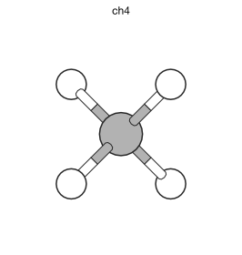
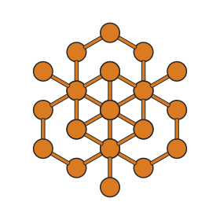

Getting started
===============

Installation
------------

Install hofmann from PyPI:

.. code-block:: bash

   pip install hofmann

For ASE interoperability (optional):

.. code-block:: bash

   pip install "hofmann[ase]"

For pymatgen interoperability (optional):

.. code-block:: bash

   pip install "hofmann[pymatgen]"

For animation export (GIF/MP4):

.. code-block:: bash

   pip install "hofmann[animation]"

For development (tests + docs):

.. code-block:: bash

   pip install "hofmann[all]"

Requirements
~~~~~~~~~~~~

- Python 3.11+
- numpy >= 1.24
- matplotlib >= 3.7
- scipy >= 1.10
- ase >= 3.22 (optional, for :func:`~hofmann.from_ase`)
- pymatgen >= 2024.1.1 (optional, for :func:`~hofmann.from_pymatgen`)

Rendering from an XBS file
--------------------------

The XBS ``.bs`` file format describes atoms, species styles, and bond
rules in a simple text format (see :doc:`xbs-format`).

.. code-block:: python

   from hofmann import StructureScene

   scene = StructureScene.from_xbs("ch4.bs")
   scene.render_mpl("ch4.svg")

The output format is inferred from the file extension: ``.svg``, ``.pdf``,
and ``.png`` are all supported.

Rendering from ASE
------------------

If you have ASE installed, you can build a scene directly from an
``Atoms`` object:

.. code-block:: python

   from ase.build import bulk
   from hofmann import StructureScene, BondSpec

   atoms = bulk("Si", "diamond", a=5.43)
   bonds = [BondSpec(species=("Si", "Si"), max_length=2.8)]
   scene = StructureScene.from_ase(atoms, bonds)
   scene.render_mpl("si.pdf")

Both periodic and non-periodic ``Atoms`` objects are supported.  For
periodic systems, fractional coordinates are wrapped into the unit cell
automatically.  For non-periodic systems (molecules), Cartesian
positions are stored directly.

See :func:`~hofmann.from_ase` for full details.

Rendering from pymatgen
-----------------------

If you have pymatgen installed, you can build a scene directly from a
``Structure`` object:

.. code-block:: python

   from pymatgen.core import Lattice, Structure
   from hofmann import StructureScene, BondSpec

   lattice = Lattice.cubic(5.43)
   structure = Structure(
       lattice, ["Si"] * 8,
       [[0.0, 0.0, 0.0], [0.5, 0.5, 0.0],
        [0.5, 0.0, 0.5], [0.0, 0.5, 0.5],
        [0.25, 0.25, 0.25], [0.75, 0.75, 0.25],
        [0.75, 0.25, 0.75], [0.25, 0.75, 0.75]],
   )

   bonds = [BondSpec(species=("Si", "Si"), max_length=2.8)]
   scene = StructureScene.from_pymatgen(structure, bonds)
   scene.render_mpl("si.pdf")

See :func:`~hofmann.from_pymatgen` for full details on periodic boundary
condition expansion and polyhedra support.
