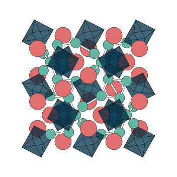

hofmann
=======

**hofmann** is a modern Python reimagining of Methfessel's XBS_ ball-and-stick
viewer (1995), named after `August Wilhelm von Hofmann`_ who built the first
ball-and-stick molecular models in 1865.

hofmann renders crystal and molecular structures as depth-sorted
ball-and-stick images with static, publication-quality output via
matplotlib (vector SVG/PDF).

.. _XBS: https://www.ccl.net/cca/software/X-WINDOW/xbs/
.. _August Wilhelm von Hofmann: https://en.wikipedia.org/wiki/August_Wilhelm_von_Hofmann

Quick example
-------------

.. code-block:: python

   from hofmann import StructureScene

   scene = StructureScene.from_xbs("structure.bs")
   scene.render_mpl("output.svg")

.. toctree::
   :maxdepth: 2
   :hidden:

   getting-started
   scenes
   rendering
   colouring
   interactive
   api
   xbs-format
   citing
   changelog
