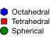
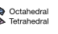
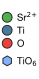

Custom legends
==============

The :ref:`species legend <legend-widget>` auto-generates entries from the
scene's atom styles.  When this is not enough — for example, when atoms
are coloured by custom data (via ``colour_by``), or when the legend
should distinguish polyhedra types rather than atom species — you can
build a fully custom legend from individual :class:`~hofmann.LegendItem`
entries.

Pass a tuple of items to :class:`~hofmann.LegendStyle`:

.. code-block:: python

   from hofmann import AtomLegendItem, LegendStyle

   style = LegendStyle(items=(
       AtomLegendItem(key="octahedral", colour="blue", label="Octahedral"),
       AtomLegendItem(key="tetrahedral", colour="red", label="Tetrahedral"),
   ))
   scene.render_mpl("output.svg", show_legend=True, legend_style=style)

When ``items`` is provided, the ``species`` and ``labels`` parameters
are ignored — each item carries its own key, colour, and optional
label.

Marker types
------------

Each legend entry uses one of three marker types.

Circles
~~~~~~~

:class:`~hofmann.AtomLegendItem` draws a filled circle — the same
marker used by the auto-generated species legend.  This is the
simplest item type and a good default when no shape distinction is
needed.

Polygons
~~~~~~~~

:class:`~hofmann.PolygonLegendItem` draws a regular polygon, useful
for indicating polyhedra types.  ``sides`` sets the number of edges
and ``rotation`` controls the orientation in degrees:

.. code-block:: python

   from hofmann import AtomLegendItem, PolygonLegendItem

   items = (
       PolygonLegendItem(key="oct", colour="blue", label="Octahedral", sides=6),
       PolygonLegendItem(key="tet", colour="red", label="Tetrahedral", sides=4, rotation=45.0),
       AtomLegendItem(key="round", colour="green", label="Spherical"),
   )
   style = LegendStyle(items=items)
   scene.render_mpl("output.svg", show_legend=True, legend_style=style)

   Hexagon, rotated square, and circle markers.

3D polyhedra
~~~~~~~~~~~~

When a legend entry represents a polyhedron type, a flat marker is a
poor visual match for the shaded 3D shape in the scene.
:class:`~hofmann.PolyhedronLegendItem` renders a miniature
depth-sorted, shaded icon instead:

.. code-block:: python

   from hofmann import PolyhedronLegendItem

   items = (
       PolyhedronLegendItem(key="oct", colour="steelblue",
                            label="Octahedral", shape="octahedron", alpha=0.4),
       PolyhedronLegendItem(key="tet", colour="goldenrod",
                            label="Tetrahedral", shape="tetrahedron", alpha=0.4),
       PolyhedronLegendItem(key="cuboct", colour="mediumseagreen",
                            label="Cuboctahedral", shape="cuboctahedron", alpha=0.4),
   )
   style = LegendStyle(items=items)

   3D-shaded polyhedron legend icons.

Supported shapes are ``"octahedron"``, ``"tetrahedron"``, and
``"cuboctahedron"``.

Polyhedron icons default to twice the flat-marker radius so that
the 3D shading is legible at typical figure sizes.  Override with
``radius`` on the item if needed.

**Shading.** The shading uses the same Lambertian-style lighting as
the main scene.  Control its strength with ``polyhedra_shading``
(0 = flat colour, 1 = full shading):

.. list-table::
   :widths: 50 50

   * - .. figure:: _static/legend_polyhedra_shading_flat.svg
          :align: center
          :width: 60%

          ``polyhedra_shading=0.0``

     - .. figure:: _static/legend_polyhedra_shading_full.svg
          :align: center
          :width: 60%

          ``polyhedra_shading=1.0``

**Icon rotation.** By default, polyhedron icons are drawn at a fixed
oblique viewing angle.  Pass ``rotation`` to orient the icon
differently.  Two forms are accepted:

- ``(Rx, Ry)`` **tuple** — rotation angles in degrees about the *x*
  and *y* axes, applied as ``Ry @ Rx``.
- ``(3, 3)`` **numpy array** — a full rotation matrix used directly.

``None`` (the default) uses the built-in oblique angle.

.. code-block:: python

   import numpy as np
   from hofmann import PolyhedronLegendItem

   # Tilt 30 degrees about x, 45 about y:
   PolyhedronLegendItem(
       key="oct", colour="steelblue", shape="octahedron",
       rotation=(30.0, 45.0),
   )

   # Full rotation matrix (e.g. identity for a top-down view):
   PolyhedronLegendItem(
       key="oct", colour="steelblue", shape="octahedron",
       rotation=np.eye(3),
   )

Customising appearance
----------------------

The following properties are shared across all marker types.

Sizing
~~~~~~

Each item can set an explicit ``radius`` (in points).  Items without
one fall back to the style-level ``circle_radius`` when it is a plain
float, or to the default (5.0 points) otherwise.

.. code-block:: python

   AtomLegendItem(key="large", colour="blue", radius=8.0)

Opacity
~~~~~~~

Set ``alpha`` (0.0--1.0) to make a marker face semi-transparent.
Marker outlines remain fully opaque, matching the visual style of
polyhedra with translucent faces and solid edges:

.. code-block:: python

   PolygonLegendItem(key="oct", colour="blue", label="TiO6", sides=6, alpha=0.5)

Edge styling
~~~~~~~~~~~~

Each item can carry its own ``edge_colour`` and ``edge_width``,
overriding the scene-level outline settings.  When not set, the item
falls back to the scene's ``outline_colour`` and ``outline_width``.
Setting ``show_outlines=False`` disables edges for items that do not
define their own edge styling; explicit per-item values are still
honoured:

.. code-block:: python

   PolyhedronLegendItem(
       key="oct", colour="steelblue", shape="octahedron",
       edge_colour="red", edge_width=2.0,
   )

Spacing and grouping
~~~~~~~~~~~~~~~~~~~~

Each item can control the vertical gap below it via ``gap_after``
(in points).  Items without ``gap_after`` fall back to
``LegendStyle.spacing``.  This is useful for visually grouping
related entries:

.. code-block:: python

   items = (
       AtomLegendItem(key="Sr", colour="green"),
       AtomLegendItem(key="Ti", colour="silver"),
       AtomLegendItem(key="O", colour="red", gap_after=8.0),
       PolygonLegendItem(key="oct", colour="blue", label="TiO6", sides=6),
       PolygonLegendItem(key="tet", colour="purple", label="SrO12", sides=4, rotation=45.0),
   )
   style = LegendStyle(items=items)

   Larger gap separates the species group from the polyhedra group.

.. note::

   Spacing between entries is based on the bounding circle of
   each marker.  Use ``gap_after`` to fine-tune spacing when mixing
   marker types of different sizes.

Building from scene data
------------------------

When building a legend to match existing polyhedra in a scene, use
:meth:`~hofmann.PolyhedronLegendItem.from_polyhedron_spec` to inherit
colour, alpha, and edge styling from the
:class:`~hofmann.PolyhedronSpec`:

.. code-block:: python

   from hofmann import PolyhedronLegendItem, PolyhedronSpec

   spec = PolyhedronSpec(
       centre="Ti",
       colour=(0.5, 0.7, 1.0),
       alpha=0.3,
       edge_colour=(0.3, 0.3, 0.3),
   )
   item = PolyhedronLegendItem.from_polyhedron_spec(spec, "octahedron")
   # item.colour, item.alpha, item.edge_colour, item.edge_width
   # all inherited from spec
