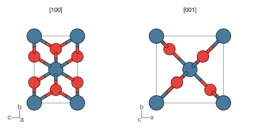

Rendering
=========

Controlling the view
--------------------

The :class:`~hofmann.ViewState` controls rotation, zoom, perspective,
and slab clipping.

Rotation
~~~~~~~~

Set the viewing direction with :meth:`~hofmann.ViewState.look_along`:

.. code-block:: python

   scene.view.look_along([1, 1, 0])  # View along [110]

Or set the rotation matrix directly:

.. code-block:: python

   import numpy as np
   scene.view.rotation = np.eye(3)  # Identity (default)

Zoom
~~~~

.. code-block:: python

   scene.view.zoom = 1.5  # Zoom in

Perspective
~~~~~~~~~~~

.. code-block:: python

   scene.view.perspective = 0.3  # Mild perspective
   scene.view.perspective = 0.0  # Orthographic (default)

.. list-table::
   :widths: 50 50

   * - .. figure:: _static/perovskite_ortho.svg

          Orthographic (``perspective=0.0``)

     - .. figure:: _static/perovskite_perspective.svg

          Perspective (``perspective=0.5``)

Slab clipping
~~~~~~~~~~~~~

Restrict the visible depth range to show a slice through the structure:

.. code-block:: python

   scene.view.slab_near = -2.0
   scene.view.slab_far = 2.0

See :meth:`~hofmann.ViewState.slab_mask` for how slab visibility is
computed.

Render styles
-------------

:class:`~hofmann.RenderStyle` groups all visual appearance settings
independent of the structure data.  You can pass a full style object
or use convenience keyword arguments:

.. code-block:: python

   from hofmann import RenderStyle

   # Via a style object:
   style = RenderStyle(
       atom_scale=0.8,
       show_outlines=False,
       half_bonds=False,
   )
   scene.render_mpl("clean.svg", style=style)

   # Or as convenience kwargs:
   scene.render_mpl("clean.svg", atom_scale=0.8,
                     show_outlines=False, half_bonds=False)

Any :class:`~hofmann.RenderStyle` field can be passed as a keyword
argument to :meth:`~hofmann.StructureScene.render_mpl`.  Unknown
keyword names raise :class:`TypeError`.

Here is the same SrTiO\ :sub:`3` perovskite rendered with different styles:

.. list-table::
   :widths: 50 50

   * - .. figure:: _static/perovskite_plain.svg

          Ball-and-stick

     - .. figure:: _static/perovskite.svg

          With polyhedra

   * - .. figure:: _static/perovskite_spacefill.svg

          Space-filling (``atom_scale=1.0``)

     - .. figure:: _static/perovskite_no_outlines.svg

          Outlines disabled (``show_outlines=False``)

Key style options:

- ``atom_scale`` -- ``0.5`` for ball-and-stick, ``1.0`` for space-filling
- ``half_bonds`` -- colour each bond half to match the nearest atom
- ``show_bonds`` / ``show_polyhedra`` -- toggle bond or polyhedra drawing
- ``show_outlines`` -- toggle atom and bond outlines
- ``show_cell`` -- toggle unit cell edges (auto-detected by default;
  see :ref:`unit-cell` below)
- ``cell_style`` -- :class:`~hofmann.CellEdgeStyle` for cell edge
  colour, width, and linestyle
- ``show_axes`` -- toggle axes orientation widget (auto-detected by
  default; see :ref:`axes-widget` below)
- ``axes_style`` -- :class:`~hofmann.AxesStyle` for widget
  colour, labels, corner, and sizing
- ``slab_clip_mode`` -- how slab clipping interacts with polyhedra
  (see :ref:`slab-clipping` below)
- ``circle_segments`` / ``arc_segments`` -- polygon resolution for
  static output (defaults are publication quality)
- ``interactive_circle_segments`` / ``interactive_arc_segments`` --
  polygon resolution for the interactive viewer (lower defaults
  for responsive redraws)

Half-bonds
~~~~~~~~~~

When ``half_bonds=True`` (the default), each bond is split at the
midpoint and each half is coloured to match the nearest atom.  With
``half_bonds=False``, bonds use the colour from their
:class:`~hofmann.BondSpec`.

.. list-table::
   :widths: 50 50

   * - .. figure:: _static/octahedron_half_bonds.svg

          ``half_bonds=True`` (default)

     - .. figure:: _static/octahedron_no_half_bonds.svg

          ``half_bonds=False``

Polyhedra shading
-----------------

The ``polyhedra_shading`` setting controls diffuse (Lambertian) shading
on polyhedra faces.  At ``0.0`` all faces are flat; at ``1.0`` (the
default) faces pointing towards the viewer are bright and edge-on faces
are dimmed.

.. list-table::
   :widths: 50 50

   * - .. figure:: _static/octahedron_shading_flat.svg

          ``polyhedra_shading=0.0`` (flat)

     - .. figure:: _static/octahedron_shading_full.svg

          ``polyhedra_shading=1.0`` (Lambertian)

.. _slab-clipping:

Slab clipping and polyhedra
---------------------------

The ``slab_clip_mode`` setting on :class:`~hofmann.RenderStyle`
controls how polyhedra at the slab boundary are handled:

- ``"per_face"`` (default) -- drop individual faces whose vertices
  are outside the slab
- ``"clip_whole"`` -- hide the entire polyhedron if any vertex is
  clipped
- ``"include_whole"`` -- force the complete polyhedron to be visible
  when its centre atom is within the slab

Here is the LLZO garnet with a depth slab that clips through several
ZrO\ :sub:`6` octahedra, rendered with each mode:

.. list-table::
   :widths: 33 33 33

   * - .. figure:: _static/llzo_clip_whole.svg

          ``"clip_whole"``

     - .. figure:: _static/llzo_clip_per_face.svg

          ``"per_face"``

     - .. figure:: _static/llzo_clip_include_whole.svg

          ``"include_whole"``

.. _unit-cell:

Unit cell
---------

For scenes created from pymatgen ``Structure`` objects, the unit cell
wireframe is drawn automatically.  The 12 cell edges are
depth-interleaved with atoms, bonds, and polyhedra so they correctly
occlude and are occluded.

Disable cell edges or customise their appearance via
:class:`~hofmann.RenderStyle`:

.. code-block:: python

   # Disable cell edges:
   scene.render_mpl("output.svg", show_cell=False)

   # Custom cell edge style:
   from hofmann import CellEdgeStyle, RenderStyle

   style = RenderStyle(
       cell_style=CellEdgeStyle(
           colour="blue",
           line_width=1.2,
           linestyle="dashed",
       ),
   )
   scene.render_mpl("output.svg", style=style)

Available linestyles: ``"solid"`` (default), ``"dashed"``,
``"dotted"``, and ``"dashdot"``.

Scenes loaded from XBS files have no lattice information, so cell
edges are not drawn.  You can set a lattice manually:

.. code-block:: python

   import numpy as np
   scene = StructureScene.from_xbs("structure.bs")
   scene.lattice = np.diag([5.43, 5.43, 5.43])  # Cubic, 5.43 A

.. _axes-widget:

Axes orientation widget
-----------------------

For periodic structures, an axes orientation widget shows the
crystallographic **a**, **b**, **c** lattice directions as lines in
a corner of the figure.  The widget is drawn automatically when a
lattice is present (the same auto-detection as unit cell edges) and
rotates in sync with the structure.

Disable or customise the widget via :class:`~hofmann.RenderStyle`:

.. code-block:: python

   # Disable the axes widget:
   scene.render_mpl("output.svg", show_axes=False)

   # Custom widget style:
   from hofmann import AxesStyle, RenderStyle

   style = RenderStyle(
       axes_style=AxesStyle(
           corner="top_right",
           colours=("red", "green", "blue"),
           labels=("x", "y", "z"),
       ),
   )
   scene.render_mpl("output.svg", style=style)

Rendering into existing axes
-----------------------------

By default :meth:`~hofmann.StructureScene.render_mpl` creates its own
figure.  Pass the ``ax`` parameter to draw into an existing matplotlib
axes instead — useful for multi-panel figures or combining a structure
with other plots:

.. code-block:: python

   import matplotlib.pyplot as plt
   from hofmann import StructureScene

   scene = StructureScene.from_xbs("structure.bs")

   fig, (ax1, ax2) = plt.subplots(1, 2, figsize=(10, 5))
   ax1.plot(x, y)              # Your own data
   scene.render_mpl(ax=ax2)    # Structure alongside
   fig.savefig("panel.pdf", bbox_inches="tight")

When ``ax`` is provided, the caller retains full control of the parent
figure — the *output*, *figsize*, *dpi*, and *show* parameters are
ignored.

As an example, here is rutile TiO\ :sub:`2` viewed along [100] and
[001], showing the distinct projections perpendicular and parallel to
the *c* axis:

.. code-block:: python

   import matplotlib.pyplot as plt
   from hofmann import StructureScene

   scene = StructureScene.from_pymatgen(structure, bond_specs)

   fig, (ax1, ax2) = plt.subplots(1, 2, figsize=(8, 4))
   for ax, direction, label in zip(
       [ax1, ax2], [[1, 0, 0], [0, 0, 1]], ["[100]", "[001]"],
   ):
       scene.view.look_along(direction)
       scene.title = label
       scene.render_mpl(ax=ax)

   fig.tight_layout()
   fig.savefig("projections.pdf", bbox_inches="tight")
