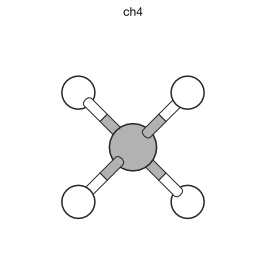
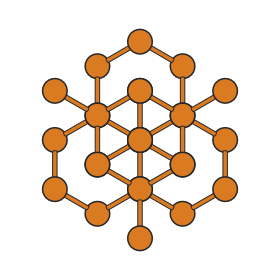
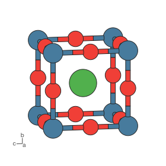
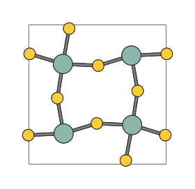
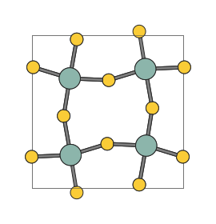
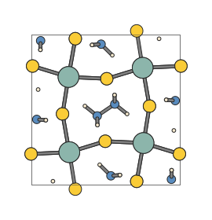
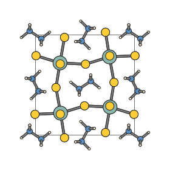
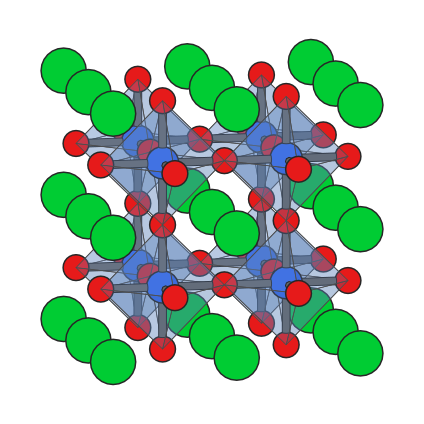

Scenes and structures
=====================

Scenes and frames
-----------------

A :class:`~hofmann.StructureScene` is the central object in hofmann.  It
holds everything needed to render a structure:

- **species** -- one label per atom (e.g. ``["C", "H", "H", "H", "H"]``)
- **frames** -- one or more :class:`~hofmann.Frame` coordinate snapshots
- **atom_styles** -- mapping from species to :class:`~hofmann.AtomStyle`
  (radius and colour)
- **bond_specs** -- declarative :class:`~hofmann.BondSpec` rules
- **polyhedra** -- optional :class:`~hofmann.PolyhedronSpec` rules
- **view** -- a :class:`~hofmann.ViewState` controlling the camera

Scenes are typically created via :meth:`~hofmann.StructureScene.from_xbs`
or :meth:`~hofmann.StructureScene.from_pymatgen`, but you can also
construct one directly from data.

Here is a simple CH\ :sub:`4` molecule loaded from an XBS file:

.. code-block:: python

   from hofmann import StructureScene

   scene = StructureScene.from_xbs("ch4.bs")
   scene.render_mpl()

Periodic boundary conditions
-----------------------------

When building a scene from a pymatgen ``Structure``,
:func:`~hofmann.from_pymatgen` can add periodic image atoms so that
bonds crossing cell boundaries are drawn correctly.  This is controlled
by two parameters:

- ``pbc`` (default ``True``) -- enable or disable PBC expansion
  entirely.
- ``pbc_padding`` (default ``0.1`` angstroms) -- the Cartesian margin
  around the unit cell.  Atoms within this distance of a cell face get
  an image on the opposite side.  The default of 0.1 angstroms
  captures atoms sitting on cell boundaries without cluttering the
  scene.  Set to ``None`` to fall back to the maximum bond length from
  *bond_specs*, which gives wider geometric expansion.

.. code-block:: python

   scene = StructureScene.from_pymatgen(
       structure, bonds, pbc=True, pbc_padding=0.1,
   )

When polyhedra are defined, the PBC expansion also ensures that every
atom matching a polyhedron centre pattern has its full coordination
shell present, so that boundary polyhedra are complete.

Bonds
-----

Bonds are detected at render time from declarative
:class:`~hofmann.BondSpec` rules.  Each rule specifies a species pair,
a length range, a display radius, and a colour:

.. code-block:: python

   from hofmann import BondSpec

   spec = BondSpec(
       species=("C", "H"),
       min_length=0.0,
       max_length=1.2,
       radius=0.1,
       colour=0.8,  # Grey
   )

Species matching supports wildcards:

.. code-block:: python

   # Match any bond between any species:
   BondSpec(species=("*", "*"), min_length=0.0, max_length=2.5,
            radius=0.1, colour="grey")

When no bond specs are provided, :func:`~hofmann.from_pymatgen`
generates sensible defaults from :data:`~hofmann.COVALENT_RADII`.

Bond completion across boundaries
~~~~~~~~~~~~~~~~~~~~~~~~~~~~~~~~~

When atoms sit near cell boundaries, some of their bonded neighbours
may lie outside the ``pbc_padding`` margin and are not included in the
scene.  Without those image atoms the bonds are missing entirely.  In
the structure below, Zr atoms at the cell boundary are missing some
of their S neighbours:

Setting ``complete`` on a bond spec tells hofmann to add the missing
neighbours.  Here ``complete="Zr"`` adds missing S neighbours around
visible Zr atoms, without pulling in new Zr images around visible S:

.. code-block:: python

   BondSpec(species=("S", "Zr"), min_length=0.0, max_length=2.9,
            radius=0.1, colour=0.5, complete="Zr")

Use ``complete="*"`` to complete around both species in the pair.

Recursive bond search
~~~~~~~~~~~~~~~~~~~~~

Bond completion adds missing neighbours in a single pass, but does
not follow chains.  For molecules that span periodic boundaries the
missing partners may themselves have missing partners.  In the full
structure below, the Zr-S bonds are complete but
N\ :sub:`2`\ H\ :sub:`6` molecules that cross a cell face are broken:

Setting ``recursive=True`` tells hofmann to iteratively search for
bonded atoms across boundaries until no new atoms are found:

.. code-block:: python

   bonds = [
       BondSpec(species=("S", "Zr"), min_length=0.0, max_length=2.9,
                radius=0.1, colour=0.5, complete="Zr"),
       BondSpec(species=("N", "N"), min_length=0.0, max_length=1.9,
                radius=0.1, colour=0.5, recursive=True),
       BondSpec(species=("H", "N"), min_length=0.0, max_length=1.2,
                radius=0.1, colour=0.5, recursive=True),
   ]

Iteration stops when no new atoms are found, or when
``max_recursive_depth`` is reached (default 5).  You can increase this
limit for molecules spanning many cell widths:

.. code-block:: python

   scene = StructureScene.from_pymatgen(
       structure, bonds, pbc=True, max_recursive_depth=10,
   )

Polyhedra
---------

Coordination polyhedra are built from the bond graph: for each atom
whose species matches the ``centre`` pattern, a convex hull is
constructed from its bonded neighbours.

.. code-block:: python

   from hofmann import PolyhedronSpec

   spec = PolyhedronSpec(
       centre="Ti",
       colour=(0.5, 0.7, 1.0),
       alpha=0.3,
   )
   scene = StructureScene.from_pymatgen(
       structure, bonds, polyhedra=[spec], pbc=True,
   )

Polyhedra can also inherit per-atom colours from ``colour_by``
data attached to their centre atoms.  See :doc:`colouring` for
details on per-atom colouring, custom colouring functions, and
polyhedra colour inheritance.
