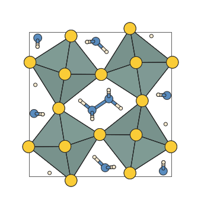
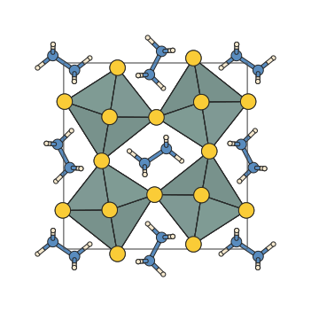

Scenes and structures
=====================

Scenes and frames
-----------------

A :class:`~hofmann.StructureScene` is the central object in hofmann.  It
holds everything needed to render a structure:

- **species** -- one label per atom (e.g. ``["C", "H", "H", "H", "H"]``)
- **frames** -- one or more :class:`~hofmann.Frame` coordinate snapshots
- **atom_styles** -- mapping from species to :class:`~hofmann.AtomStyle`
  (radius and colour)
- **bond_specs** -- declarative :class:`~hofmann.BondSpec` rules
- **polyhedra** -- optional :class:`~hofmann.PolyhedronSpec` rules
- **view** -- a :class:`~hofmann.ViewState` controlling the camera

Scenes are typically created via :meth:`~hofmann.StructureScene.from_xbs`
or :meth:`~hofmann.StructureScene.from_pymatgen`, but you can also
construct one directly from data.

Here is a simple CH4 molecule loaded from an XBS file:

.. code-block:: python

   from hofmann import StructureScene

   scene = StructureScene.from_xbs("ch4.bs")
   scene.render_mpl()

.. image:: _static/ch4.svg
   :width: 320px
   :align: center
   :alt: CH4 rendered from an XBS file

Periodic boundary conditions
-----------------------------

When building a scene from a pymatgen ``Structure``,
:func:`~hofmann.from_pymatgen` can add periodic image atoms so that
bonds crossing cell boundaries are drawn correctly.  This is controlled
by two parameters:

- ``pbc`` (default ``True``) -- enable or disable PBC expansion
  entirely.
- ``pbc_padding`` (default ``0.1`` angstroms) -- the Cartesian margin
  around the unit cell.  Atoms within this distance of a cell face get
  an image on the opposite side.  The default of 0.1 angstroms
  captures atoms sitting on cell boundaries without cluttering the
  scene.  Set to ``None`` to fall back to the maximum bond length from
  *bond_specs*, which gives wider geometric expansion.

.. code-block:: python

   scene = StructureScene.from_pymatgen(
       structure, bonds, pbc=True, pbc_padding=0.1,
   )

.. image:: _static/si.svg
   :width: 320px
   :align: center
   :alt: Diamond-cubic Si with PBC expansion

When polyhedra are defined, the PBC expansion also ensures that every
atom matching a polyhedron centre pattern has its full coordination
shell present, so that boundary polyhedra are complete.

Bonds
-----

Bonds are detected at render time from declarative
:class:`~hofmann.BondSpec` rules.  Each rule specifies a species pair,
a length range, a display radius, and a colour:

.. code-block:: python

   from hofmann import BondSpec

   spec = BondSpec(
       species=("C", "H"),
       min_length=0.0,
       max_length=1.2,
       radius=0.1,
       colour=0.8,  # Grey
   )

Species matching supports wildcards:

.. code-block:: python

   # Match any bond between any species:
   BondSpec(species=("*", "*"), min_length=0.0, max_length=2.5,
            radius=0.1, colour="grey")

When no bond specs are provided, :func:`~hofmann.from_pymatgen`
generates sensible defaults from :data:`~hofmann.COVALENT_RADII`.

.. image:: _static/perovskite_plain.svg
   :width: 320px
   :align: center
   :alt: SrTiO3 perovskite with bonds

Recursive bond search
~~~~~~~~~~~~~~~~~~~~~

Molecules sometimes span unit-cell boundaries.  With the default
``pbc_padding``, atoms on the far side of the boundary may be missing,
leaving half-rendered molecules.  In the structure below, N2H6
molecules that cross a cell face are incomplete -- isolated N or H
atoms appear at the boundary with missing bonds:

Increasing ``pbc_padding`` is one workaround, but it pulls in many
unnecessary image atoms that clutter the scene.  A more targeted
approach is to set ``recursive=True`` on the relevant bond specs.
This tells hofmann to iteratively search for bonded atoms across
periodic boundaries: whenever an atom matching a recursive spec is
already visible, its bonded partners are added even if they fall
outside the ``pbc_padding`` margin.  Newly added atoms are themselves
checked on the next iteration, so that entire molecules are completed:

.. code-block:: python

   from hofmann import StructureScene, BondSpec, PolyhedronSpec
   from pymatgen.core import Structure

   structure = Structure.from_file("CONTCAR")

   bonds = [
       BondSpec(species=("S", "Zr"), min_length=0.0, max_length=2.9,
                radius=0.1, colour=0.5),
       BondSpec(species=("N", "N"), min_length=0.0, max_length=1.9,
                radius=0.1, colour=0.5, recursive=True),
       BondSpec(species=("H", "N"), min_length=0.0, max_length=1.2,
                radius=0.1, colour=0.5, recursive=True),
   ]

   scene = StructureScene.from_pymatgen(
       structure, bonds,
       polyhedra=[PolyhedronSpec(centre="Zr", alpha=0.4, hide_centre=True)],
       pbc=True,
   )
   scene.render_mpl(show_axes=False)

Iteration stops when no new atoms are found, or when
``max_recursive_depth`` is reached (default 5).  You can increase this
limit for molecules spanning many cell widths:

.. code-block:: python

   scene = StructureScene.from_pymatgen(
       structure, bonds, pbc=True, max_recursive_depth=10,
   )

Polyhedra
---------

Coordination polyhedra are built from the bond graph: for each atom
whose species matches the ``centre`` pattern, a convex hull is
constructed from its bonded neighbours.

.. code-block:: python

   from hofmann import PolyhedronSpec

   spec = PolyhedronSpec(
       centre="Ti",
       colour=(0.5, 0.7, 1.0),
       alpha=0.3,
   )
   scene = StructureScene.from_pymatgen(
       structure, bonds, polyhedra=[spec], pbc=True,
   )

.. image:: _static/perovskite.svg
   :width: 400px
   :align: center
   :alt: SrTiO3 perovskite with TiO6 octahedra

Polyhedra can also inherit per-atom colours from ``colour_by``
data attached to their centre atoms.  See :doc:`colouring` for
details on per-atom colouring, custom colouring functions, and
polyhedra colour inheritance.
