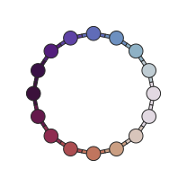
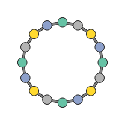

User guide
==========

Scenes and frames
-----------------

A :class:`~hofmann.StructureScene` is the central object in hofmann.  It
holds everything needed to render a structure:

- **species** -- one label per atom (e.g. ``["C", "H", "H", "H", "H"]``)
- **frames** -- one or more :class:`~hofmann.Frame` coordinate snapshots
- **atom_styles** -- mapping from species to :class:`~hofmann.AtomStyle`
  (radius and colour)
- **bond_specs** -- declarative :class:`~hofmann.BondSpec` rules
- **polyhedra** -- optional :class:`~hofmann.PolyhedronSpec` rules
- **view** -- a :class:`~hofmann.ViewState` controlling the camera

Scenes are typically created via :meth:`~hofmann.StructureScene.from_xbs`
or :meth:`~hofmann.StructureScene.from_pymatgen`, but you can also
construct one directly from data.

Here is a simple CH4 molecule loaded from an XBS file:

.. plot::
   :context: reset

   import hofmann
   from pathlib import Path
   from hofmann import StructureScene

   pkg_dir = Path(hofmann.__file__).resolve().parent
   fixture = pkg_dir.parent.parent / "tests" / "fixtures" / "ch4.bs"
   scene = StructureScene.from_xbs(fixture)
   scene.render_mpl(show=False, figsize=(4, 4))

Controlling the view
--------------------

The :class:`~hofmann.ViewState` controls rotation, zoom, perspective,
and slab clipping.

Rotation
~~~~~~~~

Set the viewing direction with :meth:`~hofmann.ViewState.look_along`:

.. code-block:: python

   scene.view.look_along([1, 1, 0])  # View along [110]

Or set the rotation matrix directly:

.. code-block:: python

   import numpy as np
   scene.view.rotation = np.eye(3)  # Identity (default)

Zoom
~~~~

.. code-block:: python

   scene.view.zoom = 1.5  # Zoom in

Perspective
~~~~~~~~~~~

.. code-block:: python

   scene.view.perspective = 0.3  # Mild perspective
   scene.view.perspective = 0.0  # Orthographic (default)

.. list-table::
   :widths: 50 50

   * - .. figure:: _static/perovskite_ortho.svg

          Orthographic (``perspective=0.0``)

     - .. figure:: _static/perovskite_perspective.svg

          Perspective (``perspective=0.5``)

Slab clipping
~~~~~~~~~~~~~

Restrict the visible depth range to show a slice through the structure:

.. code-block:: python

   scene.view.slab_near = -2.0
   scene.view.slab_far = 2.0

See :meth:`~hofmann.ViewState.slab_mask` for how slab visibility is
computed.

Render styles
-------------

:class:`~hofmann.RenderStyle` groups all visual appearance settings
independent of the structure data.  You can pass a full style object
or use convenience keyword arguments:

.. code-block:: python

   from hofmann import RenderStyle

   # Via a style object:
   style = RenderStyle(
       atom_scale=0.8,
       show_outlines=False,
       half_bonds=False,
   )
   scene.render_mpl("clean.svg", style=style)

   # Or as convenience kwargs:
   scene.render_mpl("clean.svg", atom_scale=0.8,
                     show_outlines=False, half_bonds=False)

Any :class:`~hofmann.RenderStyle` field can be passed as a keyword
argument to :meth:`~hofmann.StructureScene.render_mpl`.  Unknown
keyword names raise :class:`TypeError`.

Here is the same SrTiO3 perovskite rendered with different styles:

.. list-table::
   :widths: 50 50

   * - .. figure:: _static/perovskite_plain.svg

          Ball-and-stick

     - .. figure:: _static/perovskite.svg

          With polyhedra

   * - .. figure:: _static/perovskite_spacefill.svg

          Space-filling (``atom_scale=1.0``)

     - .. figure:: _static/perovskite_no_outlines.svg

          Outlines disabled (``show_outlines=False``)

Key style options:

- ``atom_scale`` -- ``0.5`` for ball-and-stick, ``1.0`` for space-filling
- ``half_bonds`` -- colour each bond half to match the nearest atom
- ``show_bonds`` / ``show_polyhedra`` -- toggle bond or polyhedra drawing
- ``show_outlines`` -- toggle atom and bond outlines
- ``show_cell`` -- toggle unit cell edges (auto-detected by default;
  see :ref:`unit-cell` below)
- ``cell_style`` -- :class:`~hofmann.CellEdgeStyle` for cell edge
  colour, width, and linestyle
- ``show_axes`` -- toggle axes orientation widget (auto-detected by
  default; see :ref:`axes-widget` below)
- ``axes_style`` -- :class:`~hofmann.AxesStyle` for widget
  colour, labels, corner, and sizing
- ``slab_clip_mode`` -- how slab clipping interacts with polyhedra
  (see :ref:`slab-clipping` below)
- ``circle_segments`` / ``arc_segments`` -- polygon resolution for
  static output (defaults are publication quality)
- ``interactive_circle_segments`` / ``interactive_arc_segments`` --
  polygon resolution for the interactive viewer (lower defaults
  for responsive redraws)

Half-bonds
~~~~~~~~~~

When ``half_bonds=True`` (the default), each bond is split at the
midpoint and each half is coloured to match the nearest atom.  With
``half_bonds=False``, bonds use the colour from their
:class:`~hofmann.BondSpec`.

.. list-table::
   :widths: 50 50

   * - .. figure:: _static/octahedron_half_bonds.svg

          ``half_bonds=True`` (default)

     - .. figure:: _static/octahedron_no_half_bonds.svg

          ``half_bonds=False``

Bonds
-----

Bonds are detected at render time from declarative
:class:`~hofmann.BondSpec` rules.  Each rule specifies a species pair,
a length range, a display radius, and a colour:

.. code-block:: python

   from hofmann import BondSpec

   spec = BondSpec(
       species=("C", "H"),
       min_length=0.0,
       max_length=1.2,
       radius=0.1,
       colour=0.8,  # Grey
   )

Species matching supports wildcards:

.. code-block:: python

   # Match any bond between any species:
   BondSpec(species=("*", "*"), min_length=0.0, max_length=2.5,
            radius=0.1, colour="grey")

When no bond specs are provided, :func:`~hofmann.from_pymatgen`
generates sensible defaults from :data:`~hofmann.COVALENT_RADII`.

Polyhedra
---------

Coordination polyhedra are built from the bond graph: for each atom
whose species matches the ``centre`` pattern, a convex hull is
constructed from its bonded neighbours.

.. code-block:: python

   from hofmann import PolyhedronSpec

   spec = PolyhedronSpec(
       centre="Ti",
       colour=(0.5, 0.7, 1.0),
       alpha=0.3,
   )
   scene = StructureScene.from_pymatgen(
       structure, bonds, polyhedra=[spec], pbc=True,
   )

Polyhedra shading
~~~~~~~~~~~~~~~~~

The ``polyhedra_shading`` setting controls diffuse (Lambertian) shading
on polyhedra faces.  At ``0.0`` all faces are flat; at ``1.0`` (the
default) faces pointing towards the viewer are bright and edge-on faces
are dimmed.

.. list-table::
   :widths: 50 50

   * - .. figure:: _static/octahedron_shading_flat.svg

          ``polyhedra_shading=0.0`` (flat)

     - .. figure:: _static/octahedron_shading_full.svg

          ``polyhedra_shading=1.0`` (Lambertian)

.. _slab-clipping:

Slab clipping and polyhedra
~~~~~~~~~~~~~~~~~~~~~~~~~~~

The ``slab_clip_mode`` setting on :class:`~hofmann.RenderStyle`
controls how polyhedra at the slab boundary are handled:

- ``"per_face"`` (default) -- drop individual faces whose vertices
  are outside the slab
- ``"clip_whole"`` -- hide the entire polyhedron if any vertex is
  clipped
- ``"include_whole"`` -- force the complete polyhedron to be visible
  when its centre atom is within the slab

Here is the LLZO garnet with a depth slab that clips through several
ZrO6 octahedra, rendered with each mode:

.. list-table::
   :widths: 33 33 33

   * - .. figure:: _static/llzo_clip_whole.svg

          ``"clip_whole"``

     - .. figure:: _static/llzo_clip_per_face.svg

          ``"per_face"``

     - .. figure:: _static/llzo_clip_include_whole.svg

          ``"include_whole"``

.. _unit-cell:

Unit cell
---------

For scenes created from pymatgen ``Structure`` objects, the unit cell
wireframe is drawn automatically.  The 12 cell edges are
depth-interleaved with atoms, bonds, and polyhedra so they correctly
occlude and are occluded.

Disable cell edges or customise their appearance via
:class:`~hofmann.RenderStyle`:

.. code-block:: python

   # Disable cell edges:
   scene.render_mpl("output.svg", show_cell=False)

   # Custom cell edge style:
   from hofmann import CellEdgeStyle, RenderStyle

   style = RenderStyle(
       cell_style=CellEdgeStyle(
           colour="blue",
           line_width=1.2,
           linestyle="dashed",
       ),
   )
   scene.render_mpl("output.svg", style=style)

Available linestyles: ``"solid"`` (default), ``"dashed"``,
``"dotted"``, and ``"dashdot"``.

Scenes loaded from XBS files have no lattice information, so cell
edges are not drawn.  You can set a lattice manually:

.. code-block:: python

   import numpy as np
   scene = StructureScene.from_xbs("structure.bs")
   scene.lattice = np.diag([5.43, 5.43, 5.43])  # Cubic, 5.43 A

.. _axes-widget:

Axes orientation widget
-----------------------

For periodic structures, an axes orientation widget shows the
crystallographic **a**, **b**, **c** lattice directions as lines in
a corner of the figure.  The widget is drawn automatically when a
lattice is present (the same auto-detection as unit cell edges) and
rotates in sync with the structure.

Disable or customise the widget via :class:`~hofmann.RenderStyle`:

.. code-block:: python

   # Disable the axes widget:
   scene.render_mpl("output.svg", show_axes=False)

   # Custom widget style:
   from hofmann import AxesStyle, RenderStyle

   style = RenderStyle(
       axes_style=AxesStyle(
           corner="top_right",
           colours=("red", "green", "blue"),
           labels=("x", "y", "z"),
       ),
   )
   scene.render_mpl("output.svg", style=style)

The widget also rotates interactively in
:meth:`~hofmann.StructureScene.render_mpl_interactive`.

Colouring by per-atom data
--------------------------

Atoms can be coloured by arbitrary metadata instead of by species.
Use :meth:`~hofmann.StructureScene.set_atom_data` to attach a named
array and the ``colour_by`` parameter on
:meth:`~hofmann.StructureScene.render_mpl` to activate it.

Continuous data
~~~~~~~~~~~~~~~

Numerical arrays are mapped through a colourmap.  By default the
data range is auto-scaled; use ``colour_range`` to fix the limits.

.. code-block:: python

   import numpy as np

   angles = np.linspace(0, 360, len(scene.species), endpoint=False)
   scene.set_atom_data("angle", angles)
   scene.render_mpl("output.svg", colour_by="angle", cmap="twilight")

Categorical data
~~~~~~~~~~~~~~~~

String arrays assign a distinct colour to each unique value.

.. code-block:: python

   labels = ["alpha", "beta", "gamma", "delta"] * 4
   scene.set_atom_data("site", labels)
   scene.render_mpl("output.svg", colour_by="site", cmap="Set2")

Atoms with ``NaN`` (numeric) or ``""`` (categorical) values fall
back to their species colour.  This is useful when metadata is only
available for a subset of atoms:

.. code-block:: python

   # Only colour specific atoms by charge; the rest keep species colours.
   scene.set_atom_data("charge", {0: 1.2, 3: -0.8, 5: 0.4})

Custom colouring functions
~~~~~~~~~~~~~~~~~~~~~~~~~~

Instead of a colourmap name you can pass any callable that maps a
float in ``[0, 1]`` to an ``(r, g, b)`` tuple:

.. code-block:: python

   def red_blue(t: float) -> tuple[float, float, float]:
       """Linearly interpolate from red to blue."""
       return (1.0 - t, 0.0, t)

   scene.render_mpl("output.svg", colour_by="charge", cmap=red_blue)

This works with any callable, including ``lambda`` expressions and
matplotlib ``Colormap`` objects.

Multiple colouring layers
~~~~~~~~~~~~~~~~~~~~~~~~~

When different subsets of atoms should use different colouring rules,
pass a list of keys to ``colour_by``.  Each layer is tried in order
and the first non-missing value wins.  ``cmap`` and ``colour_range``
can also be lists of the same length (or a single value broadcast to
all layers):

.. code-block:: python

   # Colour metals by type, oxygens by coordination number.
   scene.set_atom_data("metal_type", {0: "Fe", 2: "Co"})
   scene.set_atom_data("o_coord", {1: 4, 3: 6})
   scene.render_mpl(
       "output.svg",
       colour_by=["metal_type", "o_coord"],
       cmap=["Set1", "Blues"],
   )

Atoms with missing data in all layers fall back to their species
colour.

Interactive viewer
------------------

See :doc:`interactive` for full documentation of the interactive viewer,
including mouse and keyboard controls.
